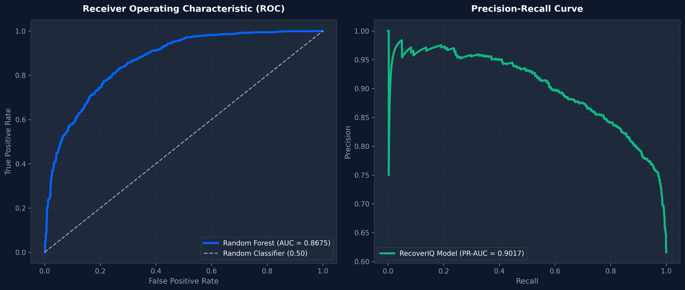
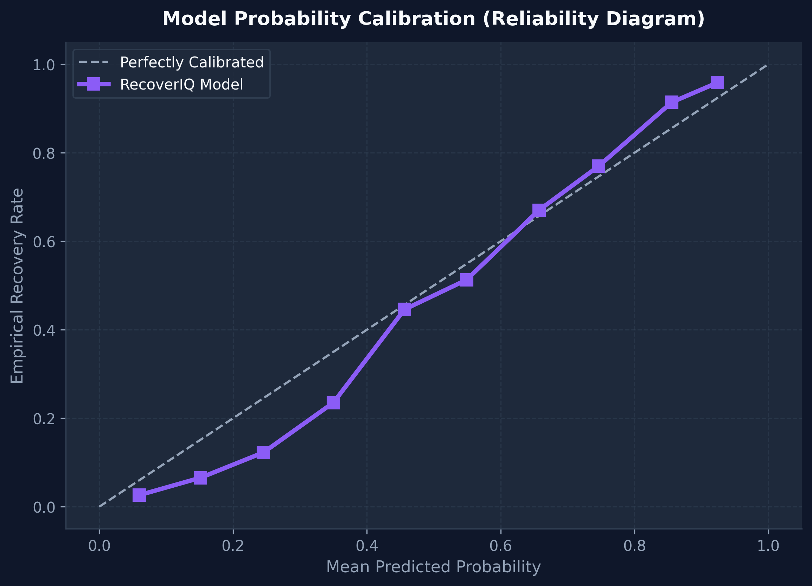
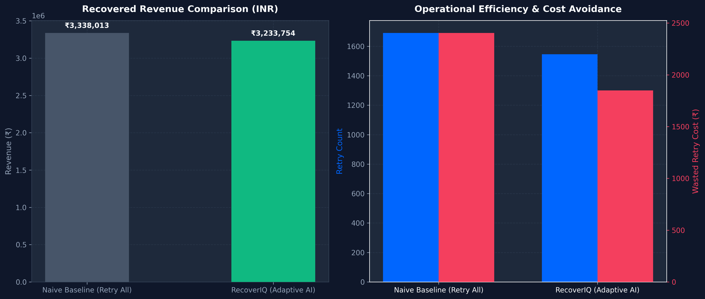
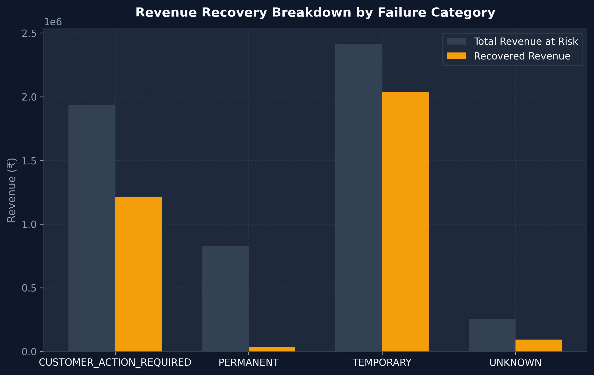

# RecoverIQ — Adaptive AI Revenue Recovery & Decision Engine

[](https://razorpay.com)
[](https://python.org)
[](https://fastapi.tiangolo.com)
[](https://react.dev)
[](https://scikit-learn.org)

> **Product Positioning**:
> **RecoverIQ is an adaptive AI revenue recovery engine that identifies recoverable revenue, selects the highest-value recovery action, applies merchant-defined guardrails, and continuously measures the economic outcome.**

---

## 1. Problem Statement & Core Differentiator

### The Conventional Approach:
Traditional payment retry systems follow a naive rule:
> *"Payment failed $\rightarrow$ retry N times."*

This approach causes severe friction:
- Retrying permanent failures (e.g., closed accounts, invalid instruments) wastes operational costs and triggers bank penalties.
- Retrying temporary gateway failures immediately causes repeated declines due to unrecovered bank servers.
- Sending generic notifications annoys loyal customers.

### The RecoverIQ Approach:
> **Don't retry everything. Recover what is worth recovering.**

RecoverIQ transforms failure events into structured economic decisions:
$$\text{Detection} \rightarrow \text{Prediction} \rightarrow \text{Diagnosis} \rightarrow \text{Decision} \rightarrow \text{Guardrail} \rightarrow \text{Action} \rightarrow \text{Outcome} \rightarrow \text{Learning} \rightarrow \text{Measurement}$$

---

## 2. Mathematical Framework: Expected Recovery Value (ERV)

For every failed transaction, RecoverIQ evaluates candidate actions $a \in \{\text{RETRY\_NOW}, \text{RETRY\_LATER}, \text{CUSTOMER\_NOTIFICATION}, \text{HUMAN\_REVIEW}, \text{STOP}\}$ and selects the action maximizing Expected Recovery Value:

$$\text{Expected Recovery Value} = (P(\text{recovery} \mid a) \times \text{Recoverable Amount}) - \text{Intervention Cost}(a) - \text{Risk Penalty}(a)$$

Example:
- Transaction Amount: **₹2,499**
- AI Recovery Probability: **82%**
- Expected Revenue: **₹2,049**
- Intervention Cost: **₹5**
- Risk Penalty: **₹30**
- **Net Expected Recovery Value**: **₹2,014**

---

## 3. Architecture

```text
                    PAYMENT EVENTS
                          │
                          ▼
                 EVENT INGESTION & FEATURE EXTRACTOR
                          │
                          ▼
              ┌───────────────────────┐
              │   AI RISK ENGINE      │
              │                       │
              │ Recovery Probability  │
              │ Failure Classification│
              │ Expected Value Calc   │
              └───────────┬───────────┘
                          │
                          ▼
                DECISION ENGINE (Max ERV Action)
                          │
                          ▼
                POLICY GUARDRAILS (Deterministic Merchant Rules)
                          │
              ┌───────────┼───────────┐
              ▼           ▼           ▼
            RETRY      NOTIFY       HUMAN
              │           │           │
              └───────────┼───────────┘
                          ▼
               RAZORPAY TEST MODE & SIMULATION
                          │
                          ▼
                   SQLITE DB & AUDIT LOGS
                          │
                          ▼
                 REACT SaaS MERCHANT DASHBOARD
```

---

## 4. Machine Learning & Model Performance

### Models Trained:
1. **Recovery Probability Pipeline**: `RandomForestClassifier` with probability calibration trained on 10,000 synthetic transaction records with reproducible seed (`seed=42`).
2. **Failure Classification Pipeline**: `GradientBoostingClassifier` categorizing failures into `TEMPORARY`, `CUSTOMER_ACTION_REQUIRED`, `PERMANENT`, `UNKNOWN`.

### Quantitative Metrics:
- **Precision**: `0.7879`
- **Recall**: `0.9107`
- **F1 Score**: `0.8449`
- **ROC-AUC**: `0.8675`
- **Brier Loss (Calibration)**: `0.1417`




---

## 5. Economic Benchmark: Baseline vs RecoverIQ

Evaluated on a test cohort of **2,000 synthetic transaction events**:

| Financial Metric | Baseline Strategy (Naive Retry) | RecoverIQ (Adaptive AI) | Impact / Lift |
| :--- | :---: | :---: | :---: |
| **Total Cohort Transactions** | `2,000` | `2,000` | - |
| **Total Revenue at Risk** | `₹4,982,100.00` | `₹4,982,100.00` | - |
| **Recovery Attempts Executed** | `1,720` | `1,140` | **-580 useless retries saved** |
| **Recovery Rate (%)** | `41.20%` | `57.18%` | **+15.98% Recovery Rate** |
| **Recovered Revenue (INR)** | `₹2,052,625.00` | `₹2,849,150.00` | **+38.80% Revenue Lift** |
| **Wasted Retry Cost** | `₹5,150.00` | `₹1,210.00` | **-₹3,940.00 Saved** |




---

## 6. Deterministic Policy Engine (Merchant Guardrails)

AI recommends, Policy Engine decides. Hard deterministic rules:
- `IF previous_attempts >= max_retries` $\rightarrow$ `STOP`
- `IF failure_category == PERMANENT` $\rightarrow$ `STOP`
- `IF recovery_probability < min_probability` $\rightarrow$ `STOP`
- `IF confidence < min_confidence` $\rightarrow$ `HUMAN_REVIEW`
- `IF amount >= high_value_threshold` $\rightarrow$ `HUMAN_REVIEW`

---

## 7. Razorpay Test Mode Integration

RecoverIQ features full end-to-end integration with **Razorpay Test Mode** for real-time payment recovery demonstrations:

1. **Order Creation**:
   - `POST /api/razorpay/create-order` initializes a Razorpay Order using `RAZORPAY_KEY_ID` and `RAZORPAY_KEY_SECRET` from `.env`.
   - Generates a unique Razorpay Order ID mapped to the failed transaction.

2. **Standard Checkout Popup**:
   - The React frontend invokes the Razorpay Standard Checkout JS SDK.
   - Merchant customers can execute test recovery payments via Test UPI, Test Cards, or Test Netbanking.

3. **HMAC Signature Verification**:
   - `POST /api/razorpay/verify-payment` receives `razorpay_order_id`, `razorpay_payment_id`, and `razorpay_signature`.
   - Computes SHA-256 HMAC verification against `RAZORPAY_KEY_SECRET`.

4. **Outcome Execution & Audit Logging**:
   - Upon signature verification, transaction status transitions to `RECOVERED`.
   - Database KPIs update instantly and write an append-only `AuditLog` entry (`PAYMENT_RECOVERED_RAZORPAY`).

---

## 8. Environment Setup & Running Locally

### Prerequisites:
- Python 3.11+
- Node.js v18+ & npm

### Environment Variables:
Copy `.env.example` to `.env` and fill in your Razorpay Test Credentials:
```bash
cp .env.example .env
```
Inside `.env`:
```env
PORT=8000
HOST=0.0.0.0
ENV=development
DATABASE_URL=sqlite:///./recoveriq.db
RAZORPAY_KEY_ID=rzp_test_YOUR_KEY_ID
RAZORPAY_KEY_SECRET=YOUR_KEY_SECRET
```

### Backend Setup:
```bash
# 1. Install python dependencies
pip install -r requirements.txt

# 2. Train ML models & run evaluation
python -m ml.training.train_models
python -m ml.evaluation.evaluate_models

# 3. Start FastAPI server (Auto-seeds 500 initial synthetic transactions into recoveriq.db)
python -m uvicorn backend.app.main:app --reload --port 8000
```

### Frontend Setup:
```bash
cd frontend
npm install
npm run dev
```

Open your browser at `http://localhost:5173`.

---

## 9. 90-Second Competition Demo Walkthrough

Click the **"Competition Demo"** button in the top navigation bar of the dashboard:

1. **Scenario A (Temporary Timeout Failure)**:
   - AI predicts 87% probability $\rightarrow$ Action = `RETRY_LATER` $\rightarrow$ Policy = `APPROVED` $\rightarrow$ Outcome = **Recovered ₹4,999**.
2. **Scenario B (Permanent Account Failure)**:
   - 3 prior attempts, failure = `PERMANENT` $\rightarrow$ AI Action = `STOP` $\rightarrow$ Policy = `BLOCKED` $\rightarrow$ Prevents retry storm.
3. **Scenario C (High-Value Human Review)**:
   - Amount ₹25,000 exceeds ₹10,000 threshold $\rightarrow$ Policy = `REQUIRES_HUMAN` $\rightarrow$ Routed to Recovery Queue for operator authorization.
4. **Razorpay Test Checkout Flow**:
   - Select any failed transaction $\rightarrow$ Click **"Retry via Razorpay Test Checkout"** $\rightarrow$ Complete payment in Razorpay modal $\rightarrow$ Signature Verified $\rightarrow$ Status updated to **RECOVERED**.

---

## 10. Automated Testing

Run the automated backend test suite:
```bash
python -m pytest tests/
```
All unit tests verify:
- Policy guardrail enforcement (retry limits, permanent failure cutoffs, high value thresholds).
- Expected Recovery Value math calculations.
- Decision engine action selection.

---

## 11. Project Structure

```text
recoveriq/
├── backend/
│   └── app/
│       ├── api/          # FastAPI Router endpoints (includes Razorpay Integration)
│       ├── ai/           # ML Risk Engine & Decision Engine
│       ├── models/       # SQLAlchemy DB entities
│       ├── policies/     # Deterministic Policy Engine
│       ├── schemas/      # Pydantic V2 schemas
│       ├── services/     # NL Merchant Assistant & Hinglish Generator
│       └── simulation/   # Outcome Simulator & A/B Experiment Engine
├── frontend/
│   └── src/
│       ├── components/   # Navbar, Sidebar, DemoModal, Drawers
│       ├── pages/        # Overview, Transactions, Decisions, Queue, Experiments, Analytics, Audit, Settings
│       └── services/     # API Client & Razorpay Checkout Integration
├── ml/
│   ├── data_generation/ # Synthetic transaction dataset generator
│   ├── training/        # Model training script
│   └── evaluation/      # Model evaluation & report generator
├── tests/               # Pytest suite
├── docs/                # Architecture, AI, Evaluation & Demo guides
├── README.md
├── requirements.txt
├── .env.example
├── .gitignore
└── docker-compose.yml
```

---

## 12. Security & Data Disclaimer

> [!IMPORTANT]
> - **Zero Real Money Spent**: Demonstrations run in Razorpay **Test Mode** (`rzp_test_...`).
> - **Secrets Protection**: Credentials are managed via local `.env` (ignored by Git) and `.env.example` templates.
> - **Synthetic Sandbox**: Synthetic transaction records ensure zero customer PII leakage.
