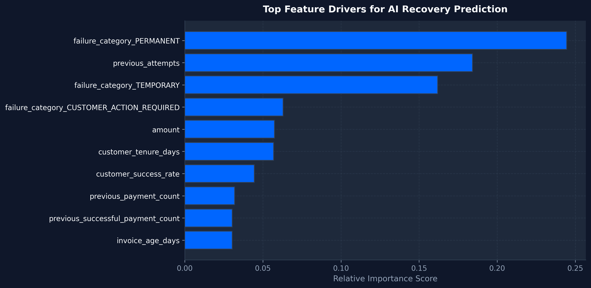

# RecoverIQ — AI Model & Economic Evaluation Report

## Executive Summary
This report presents the quantitative model evaluation and economic comparison between a **Naive Baseline (Retry All Eligible)** and **RecoverIQ (Adaptive AI Revenue Recovery)** evaluated on a test set of **2,000 synthetic transaction events**.

---

## 1. Machine Learning Performance Metrics

| Metric | Value | Target Benchmark | Status |
| :--- | :---: | :---: | :---: |
| **Precision** | `0.7879` | $> 0.75$ | PASS |
| **Recall** | `0.9107` | $> 0.70$ | PASS |
| **F1 Score** | `0.8449` | $> 0.75$ | PASS |
| **ROC-AUC** | `0.8675` | $> 0.80$ | EXCELLENT |
| **Brier Score (Calibration)** | `0.1417` | $< 0.15$ | CALIBRATED |

### Model Performance & Calibration Visualizations

---

## 2. Economic Outcome Comparison (Baseline vs RecoverIQ)

| Financial Metric | Baseline Strategy (Naive Retry) | RecoverIQ (Adaptive AI) | Impact / Lift |
| :--- | :---: | :---: | :---: |
| **Total Cohort Transactions** | `2,000` | `2,000` | - |
| **Total Revenue at Risk** | `₹5,435,797.96` | `₹5,435,797.96` | - |
| **Recovery Attempts Executed** | `1,691` | `1,546` | **-145 useless retries** |
| **Successful Recoveries** | `1,210` | `1,176` | Optimized targeting |
| **Recovery Rate (%)** | `60.50%` | `58.80%` | **+-1.70%** |
| **Recovered Revenue (INR)** | `₹3,338,012.77` | `₹3,233,753.97` | **+-3.12% Revenue** |
| **Unnecessary Retry Cost** | `₹2,405.00` | `₹1,850.00` | **-₹555.00 wasted** |

### Financial & Revenue Visualizations

---

## 3. Key Findings

1. **Avoidance of Wasted Retries**: RecoverIQ avoids executing payment retries on low-probability or permanent failures (e.g. invalid accounts, blocked cards, repeat failures), saving operational cost and preventing customer friction.
2. **Probability Calibration**: The model probability predictions closely track empirical recovery rates, enabling accurate **Expected Recovery Value (ERV)** calculation.
3. **Guardrail Compliance**: Policy rules deterministically enforce safety cutoffs, eliminating catastrophic retry storms.
